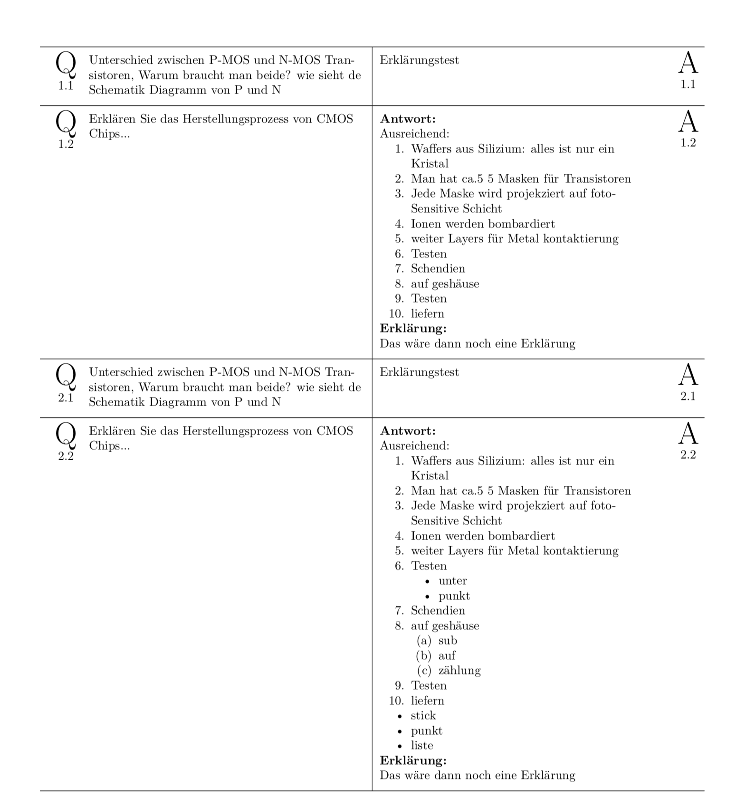

# Fragenkatalog Parser

Parse a list of questions from individual Markdown files to three different output formats.

## Input file structure

```
class/
|-- fragenkatalog/
|   |-- output/                     # Will be generated
|   |   |-- project_name.md
|   |   |-- project_name.txt
|   |   |-- project_name.pdf
|   |
|   |-- 1 <question 1 name>/
|   |   |-- 1.md
|   |   |-- 2.md
|   |   |-- 3.md
|   |
|   |-- 2 <question 2 name>/
|   |   |-- 1.md
|   |   |-- 2.md
|   |
|   ...
```

## Question file

Each question is in its own markdown file.
Each one is formatted as follows:

```markdown
# F

<QUESTION>

# A

<ANSWER>

# E

<EXPLANATION>
```

Each of the parameters is optional.

## Commandline Usage

### Arguments

```
usage: fragenkatalog_parser.py [-h] [-t] [-m] [-x] [-a] [-e] [-i] [-v]
                               directory

positional arguments:
  directory          the folder to be parsed

optional arguments:
  -h, --help         show this help message and exit
  -t, --text         generate text file
  -m, --markdown     generate markdown file
  -x, --latex        generate latex file
  -a, --answer       include answer
  -e, --explanation  include explanation
  -i, --images       copies images to the markdown file, instead of referencing original
  -v, --verbose      print tex log
```

### Example usage

```bash
./fragenkatalog_parser.py support/demo -tax -em
```

The order is pureley for giggles. It will

- **t**: Generate a text file
- **a**: Include answers
- **x**: Generate a LaTeX file
- **e**: Include explanations
- **m**: Generate a Markdown file

### Example Output

This is the output of the sample project in the support directory.

#### txt

```
support:

1. CMOS:

1.1.	Unterschied zwischen P-MOS und N-MOS Transistoren, Warum braucht man beide? wie sieht de Schematik Diagramm von P und N

	Erklärungstest

1.2.	Erklären Sie das Herstellungsprozess von CMOS Chips...

	Antwort:

	Ausreichend: 
	1. Waffers aus Silizium: alles ist nur ein Kristal
	2. Man hat ca.5 5 Masken für Transistoren
	3. Jede Maske wird projekziert auf foto-Sensitive Schicht
	4. Ionen werden bombardiert
	5. weiter Layers für Metal kontaktierung
	6. Testen
	7. Schendien
	8. auf geshäuse
	9. Testen
	10. liefern

	Erklärung:

	Das wäre dann noch eine Erklärung

2. test:

2.1.	Unterschied zwischen P-MOS und N-MOS Transistoren, Warum braucht man beide? wie sieht de Schematik Diagramm von P und N

	Erklärungstest

2.2.	Erklären Sie das Herstellungsprozess von CMOS Chips...

	Antwort:

	Ausreichend: 
	1. Waffers aus Silizium: alles ist nur ein Kristal
	2. Man hat ca.5 5 Masken für Transistoren
	3. Jede Maske wird projekziert auf foto-Sensitive Schicht
	4. Ionen werden bombardiert
	5. weiter Layers für Metal kontaktierung
	6. Testen
	    - unter
	    - punkt
	7. Schendien
	8. auf geshäuse
	    1. sub
	    2. auf
	    3. zählung
	9. Testen
	10. liefern
	* stick
	* punkt
	* liste

	Erklärung:

	Das wäre dann noch eine Erklärung
```

#### md

```markdown
# support

1. **CMOS**
	
	1. Unterschied zwischen P-MOS und N-MOS Transistoren, Warum braucht man beide? wie sieht de Schematik Diagramm von P und N
		
		
		Erklärungstest
	
	2. Erklären Sie das Herstellungsprozess von CMOS Chips...
		
		
		Ausreichend: 
		
		1. Waffers aus Silizium: alles ist nur ein Kristal
		2. Man hat ca.5 5 Masken für Transistoren
		3. Jede Maske wird projekziert auf foto-Sensitive Schicht
		4. Ionen werden bombardiert
		5. weiter Layers für Metal kontaktierung
		6. Testen
		7. Schendien
		8. auf geshäuse
		9. Testen
		10. liefern
		
		Das wäre dann noch eine Erklärung

2. **test**
	
	1. Unterschied zwischen P-MOS und N-MOS Transistoren, Warum braucht man beide? wie sieht de Schematik Diagramm von P und N
		
		
		Erklärungstest
	
	2. Erklären Sie das Herstellungsprozess von CMOS Chips...
		
		
		Ausreichend: 
		
		1. Waffers aus Silizium: alles ist nur ein Kristal
		2. Man hat ca.5 5 Masken für Transistoren
		3. Jede Maske wird projekziert auf foto-Sensitive Schicht
		4. Ionen werden bombardiert
		5. weiter Layers für Metal kontaktierung
		6. Testen
		    - unter
		    - punkt
		7. Schendien
		8. auf geshäuse
		    1. sub
		    2. auf
		    3. zählung
		9. Testen
		10. liefern
		
		* stick
		* punkt
		* liste
		
		Das wäre dann noch eine Erklärung
```

#### LaTeX

This is supposed to be cut into strips, folded in the middle and be used as question- and answercards.

